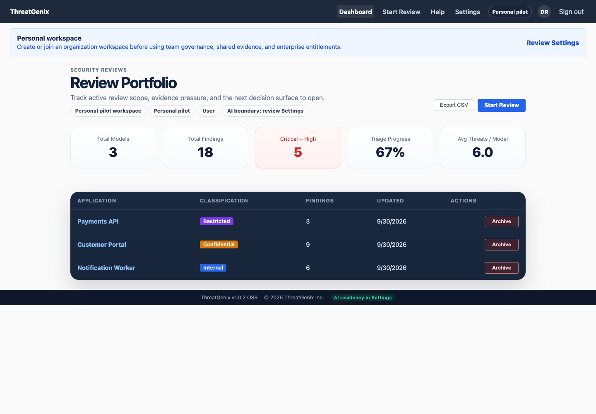
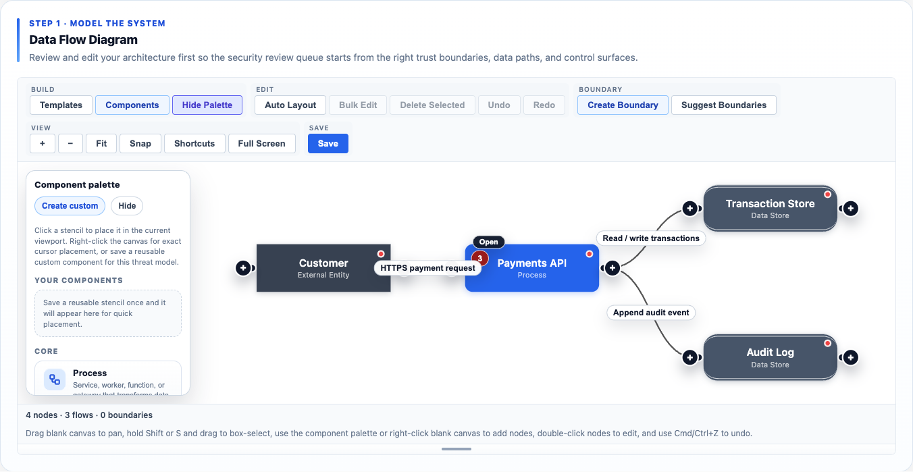
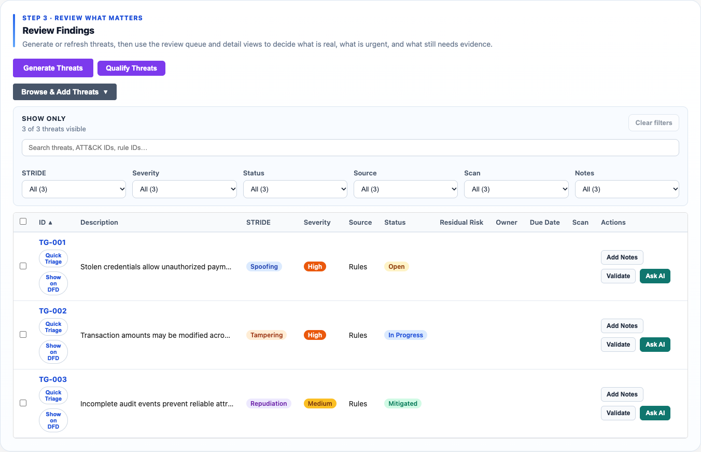

# ThreatGenix

**Open-source threat modeling and security reviews, from architecture to evidence.**

ThreatGenix is a self-hosted workspace for application security engineers and development teams. Turn system architecture into editable data flow diagrams (DFDs), identify STRIDE threats, connect findings to validation evidence, and document risk decisions in one place.

Run it on your own infrastructure. Start with deterministic threat rules, then optionally add AI assistance through local Ollama or a configured external provider.

[Get started](#how-to-run-it) · [Features](#features) · [Screenshots](#screenshots) · [Self-hosting guide](docs/self-hosting.md) · [Contributing](CONTRIBUTING.md)

## What You Can Do

1. **Describe the system.** Start a review, upload architecture documents, build a DFD, or import evidence from a GitHub repository or pull request.
2. **Find and prioritize threats.** Generate STRIDE findings, inspect affected components and flows, and filter by severity, source, and review status.
3. **Review the evidence.** Attach scanner output and validation artifacts, investigate findings, and record mitigations and risk decisions.
4. **Share the review.** Export reports and structured findings for engineering work, security reviews, and stakeholder discussions.

## Features

| Capability | What it helps you do |
| --- | --- |
| **Visual architecture modeling** | Edit components, data flows, and trust boundaries on an interactive DFD canvas. Organize diagrams into views and use component templates. |
| **Document ingestion** | Bring architecture documents into the modeling workflow and review extracted system context. |
| **STRIDE threat analysis** | Generate repeatable rule-based findings across Spoofing, Tampering, Repudiation, Information Disclosure, Denial of Service, and Elevation of Privilege. |
| **Optional AI assistance** | Enhance analysis with local Ollama or configured external providers. Core modeling, rules, evidence workflows, and reporting work without external AI. |
| **Finding triage and mitigation tracking** | Review individual or selected findings, track status, mitigation owners, due dates, and residual risk. |
| **Validation evidence** | Import scanner findings and attach validation artifacts to support threat review. Controlled scanner execution requires additional runner configuration and tool availability. |
| **GitHub context** | Import repository or pull-request evidence with configured GitHub credentials. The OSS v1 workflow supports one repository or PR source per model/review at a time. |
| **Security review decisions** | Organize application review context, evidence, and risk acceptance records for engineer-led decisions. |
| **Compliance mappings and reports** | Inspect control mappings and export PDF reports and CSV findings. Mappings support review; they do not certify compliance. |
| **Portfolio dashboard** | See active models, finding counts, severity, and triage progress across your review workspace. |
| **CLI and MCP access** | Integrate review workflows with command-line tools and MCP clients. |
| **Self-hosted storage** | Run the React frontend, FastAPI backend, and PostgreSQL/pgvector database on your own infrastructure using Docker Compose or a source setup. |

## Screenshots

These are captures of the OSS frontend with synthetic example data and mocked API responses. They illustrate the interface, not a completed security assessment or a live scanner run. See [capture instructions](docs/screenshots/README.md).

### Review portfolio

See active applications, elevated findings, and triage progress before opening a review.



### Visual architecture modeling

Build and inspect the components and data paths that form your threat model.



### STRIDE findings and triage

Filter findings by STRIDE category, severity, and status, then open each finding for review and validation.



## Release Status

Current OSS release: `v1.0.2-oss`.

This release is ready for self-hosted evaluation and internal security-review workflows. It supports one repository or pull-request evidence source per threat model or application review at a time. Re-importing repository evidence replaces the saved repository evidence for that model. Coordinated multi-repository workflows are not marketed or exposed in v1.

## What Is Included

- FastAPI backend with PostgreSQL/pgvector persistence
- React/Vite frontend for DFD editing, review workflows, validation evidence, and reporting
- CLI and MCP entry points for review automation
- Local Docker Compose stack for self-hosted development
- Optional LLM provider adapters, including local Ollama and external providers
  configured by environment variable; provider credentials and model downloads
  are not bundled
- GitHub repository or pull-request evidence import for a single source per
  model/review when the required GitHub credentials are configured
- Validation-tool ingestion and controlled scanner execution paths; the default
  Compose profile uses the non-executing `try_sandbox` mode and does not bundle
  every scanner binary

## What Is Not Included

- Hosted SaaS deployment configuration
- Private customer evidence, production smoke artifacts, or internal planning notes
- Managed cloud runner infrastructure
- Production secrets or provider credentials
- Coordinated multi-repository review orchestration

## How To Run It

Requirements:

- Docker and Docker Compose
- Node.js 20+
- Python 3.12+
- Optional: Ollama if you want local AI-assisted features

### Option A: Docker Compose

```bash
git clone https://github.com/ibrolord/threatgenix-oss.git
cd threatgenix-oss/threatgenix
docker compose up --build
```

Open:

- Frontend: http://localhost:5173
- Backend health: http://localhost:8000/api/health

If local services already use those host ports, keep Compose isolated with:

```bash
DB_PORT=55432 BACKEND_PORT=8010 FRONTEND_PORT=5180 docker compose up --build
```

The Compose stack is a local development baseline. It binds the backend and
frontend to `127.0.0.1` by default, starts PostgreSQL with pgvector, and uses the
safe example settings in `threatgenix/backend/.env.example`. The backend runs
`alembic upgrade head` before serving requests so fresh self-hosted databases are
migration-stamped.

The login limit defaults to `10/minute` per client IP. Self-hosted teams behind
a shared NAT can tune `AUTH_LOGIN_RATE_LIMIT` after reviewing their own abuse
controls and reverse-proxy behavior.

Stop it with:

```bash
docker compose down
```

Reset the local database:

```bash
make reset-db
```

### Option B: Run From Source

Start PostgreSQL:

```bash
cd threatgenix-oss/threatgenix
make dev-db
```

Start the backend:

```bash
cd threatgenix-oss/threatgenix/backend
python -m venv .venv
. .venv/bin/activate
pip install -r requirements.txt
cp .env.example .env
alembic upgrade head
uvicorn app.main:app --reload --port 8000
```

In a second terminal, start the frontend:

```bash
cd threatgenix-oss/threatgenix/frontend
npm ci
npm run dev
```

Open http://localhost:5173 and create a local account from the sign-up screen.
The frontend proxies `/api` requests to the backend on `127.0.0.1:8000`.

## How To Configure AI

ThreatGenix runs without an external AI provider. Deterministic threat rules,
DFD editing, evidence workflows, and reporting still work.

For local AI, run Ollama and keep the default provider. If Ollama is not already
running, start it in a separate terminal:

```bash
ollama serve
```

Then pull the default model:

```bash
ollama pull llama3.1
```

```env
LLM_PROVIDER=ollama
OLLAMA_BASE_URL=http://localhost:11434
OLLAMA_MODEL=llama3.1
```

For AWS Bedrock, use IAM credentials in the runtime environment:

```env
LLM_PROVIDER=bedrock
AWS_DEFAULT_REGION=ca-central-1
BEDROCK_REGION=ca-central-1
BEDROCK_MODEL_ID=ca.amazon.nova-lite-v1:0
BEDROCK_EMBEDDING_MODEL_ID=amazon.titan-embed-text-v2:0
```

For direct provider APIs, set `LLM_PROVIDER` to one of `anthropic`, `openai`,
`openrouter`, `gemini`, `xai`, `zai`, or `perplexity` and set the matching API key.
The app also supports BYOK for those direct API providers from the Settings
page. Bedrock uses AWS IAM and is not stored as a per-user BYOK key.

Z.ai uses its OpenAI-compatible endpoint:

```env
LLM_PROVIDER=zai
ZAI_API_KEY=<your Z.ai key>
ZAI_BASE_URL=https://api.z.ai/api/paas/v4
ZAI_MODEL=glm-4.6
```

Threat-intel semantic retrieval stores 1024-dimension vectors in PostgreSQL
pgvector. Bedrock Titan remains the default embedding provider, but self-hosted
deployments can opt into OpenAI-compatible embedding APIs when the selected
model can return exactly 1024 dimensions:

```env
EMBEDDING_PROVIDER=openai
OPENAI_API_KEY=<your OpenAI key>
EMBEDDING_MODEL=text-embedding-3-large
EMBEDDING_DIMENSION=1024
```

For OpenRouter, Z.ai, or another OpenAI-compatible embedding endpoint, set
`EMBEDDING_PROVIDER=openrouter`, `EMBEDDING_PROVIDER=zai`, or
`EMBEDDING_PROVIDER=openai_compatible` plus `EMBEDDING_MODEL`. Use
`EMBEDDING_API_KEY` and `EMBEDDING_BASE_URL` for a custom compatible provider.
If a provider returns anything other than 1024 dimensions, ThreatGenix rejects
the vector before writing it to pgvector.

External AI providers are opt-in. Do not set provider API keys unless your
deployment policy allows sending review context to that provider.

## How To Validate A Setup

Run the backend and frontend checks:

```bash
cd threatgenix-oss/threatgenix
make lint
make test-backend
make test-frontend
```

The evidence and known boundaries from the current release retest are recorded
in `docs/qa/v1.0.2-release-validation.md`.

Run the open-source hygiene gate before publishing a fork, release, or source
context. This command runs from the repository root:

```bash
cd threatgenix-oss
scripts/check-oss-hygiene.sh
```

The hygiene gate blocks high-signal secret patterns, tracked `.env` files,
uncommented provider keys in env examples, private/customer strings, and legacy
product naming leaks.

## How To Prepare Production

Create a real production environment file. Do not use the checked-in development
defaults:

```env
APP_ENV=production
SECRET_KEY=<generated 32+ character secret>
DATABASE_URL=postgresql+asyncpg://...
ALLOWED_ORIGINS=https://threatgenix.example.com
TRUSTED_HOSTS=api.threatgenix.example.com
AUTH_EXPOSE_DEV_TOKENS=false
LLM_PROVIDER=ollama
ALLOW_EXTERNAL_AI_PROVIDERS_IN_PRODUCTION=false
```

Production and staging startup fail closed when dangerous defaults are present:
wildcard CORS, HTTP browser origins, loopback origins, missing or wildcard
trusted hosts, local Compose database hosts, default/short secrets, or exposed
development auth tokens.

Before exposing the app beyond localhost:

- Put TLS in front of the backend and frontend.
- Run `alembic upgrade head` against the production database.
- Use managed PostgreSQL with pgvector and backups.
- Keep uploaded architecture, source, scanner, and report artifacts inside your own trust boundary.
- Enable live scanner execution only on isolated runner hosts with scoped paths and resource limits.

See `docs/self-hosting.md` and `SECURITY.md` for the production checklist.

## Troubleshooting

- Backend will not start in production: check `SECRET_KEY`, `DATABASE_URL`,
  `ALLOWED_ORIGINS`, `TRUSTED_HOSTS`, and the Alembic revision.
- Frontend cannot reach the API: confirm the backend is on `http://127.0.0.1:8000`
  or set `VITE_API_PROXY_TARGET`.
- AI calls fail with Ollama: confirm `ollama serve` is running and the configured
  model has been pulled.
- Bedrock calls fail: confirm AWS credentials, region, and model IDs are
  available to the backend process.
- Vector retrieval is unavailable: confirm PostgreSQL has pgvector enabled and
  threat-intel sync has been run with embeddings enabled.

## Security Notes

ThreatGenix is a security-analysis tool, not a security certification engine. Its output should be reviewed by a qualified engineer before it is used for release, compliance, or risk acceptance decisions.

For production use:

- Set a generated `SECRET_KEY` with at least 32 characters before first boot.
- Use TLS, a managed PostgreSQL deployment, and database backups.
- Set `ALLOWED_ORIGINS` to your HTTPS frontend origin. Do not use `*` or loopback origins.
- Set `TRUSTED_HOSTS` to the public API host so host-header attacks fail closed.
- Keep uploaded architecture, source, scanner, and report artifacts inside your own trust boundary.
- Enable live scanner execution only on isolated runner hosts with tightly scoped target paths.
- Run `scripts/check-oss-hygiene.sh` before publishing a fork or release.
- Review `SECURITY.md` before exposing the app beyond localhost.

## License

MIT. See `LICENSE`.
